# BladderDIVE 🔬

**Integrated Spatial Proteomics Analysis of Bladder Tissue Using CellDIVE Technology**

A comprehensive Snakemake pipeline for analyzing 23-channel CellDIVE multiplexed immunofluorescence data, combining automated cell segmentation, single-cell analysis, and pathologist annotations for spatial tissue characterization.

---

## 📋 Table of Contents

- [Overview](#overview)
- [Features](#features)
- [Pipeline Architecture](#pipeline-architecture)
- [Installation](#installation)
- [Quick Start](#quick-start)
- [Data Requirements](#data-requirements)
- [Pipeline Stages](#pipeline-stages)
- [Outputs](#outputs)
- [Configuration](#configuration)
- [QuPath Integration](#qupath-integration)
- [Troubleshooting](#troubleshooting)
- [Citation](#citation)

---

## 🎯 Overview

BladderDIVE is a specialized analysis pipeline for CellDIVE multiplexed immunofluorescence data of bladder tissue. The pipeline processes 23-channel images to perform:

- **Automated cell segmentation** using StarDist deep learning
- **Single-cell analysis** with clustering and dimensionality reduction
- **Cell type annotation** based on marker expression profiles
- **Spatial analysis** of tissue architecture and cell interactions
- **Integration with pathologist annotations** from Aperio XML files
- **QuPath compatibility** for interactive visualization

### 🧬 Marker Panel (23 Channels)

| **Immune Markers** | **Epithelial/Structural** | **Stromal/Vascular** | **Functional** |
|-------------------|---------------------------|---------------------|----------------|
| CD45, CD3E, CD8a | PANCK, EPCAM | VIM, COL1A1 | Ki67, CD44 |
| CD20, CD38 | | ACTA2, CD31 | HLADR |
| CD68, CD163, CD14 | | PDGFRA | |
| CD11c, CD45RO, CD56 | | | |

---

## ✨ Features

- 🔬 **Deep Learning Segmentation**: StarDist-based nuclei detection with membrane refinement
- 📊 **Comprehensive Analysis**: UMAP, Leiden clustering, cell-cell interactions
- 🏷️ **Automated Cell Typing**: Marker-based cell type classification
- 🗺️ **Spatial Analysis**: Neighborhood analysis and tissue architecture mapping
- 📈 **Rich Visualizations**: Interactive plots, heatmaps, and spatial maps
- 🎯 **QuPath Integration**: Export results for interactive pathology review
- ⚡ **Scalable Pipeline**: Snakemake workflow with conda environment management
- 📋 **Quality Control**: Comprehensive QC reports and validation metrics

---

## 🏗️ Pipeline Architecture

```mermaid
flowchart TD
    A[📁 23-Channel TIFs] --> B[🔬 segmentation]
    B --> C[📊 analysis]
    C --> D[🏷️ cell_typing]
    D --> E[📈 visualizations]
    D --> F[🗺️ qupath_export]
    C --> G[📍 spatial_analysis]
    B --> H[✅ quality_control]
    E --> I[📄 generate_report]
    F --> I
    G --> I
    H --> I
    C --> J[💾 export_data]
    
    classDef coreStage fill:#e1f5fe,stroke:#01579b,stroke-width:2px
    class B,C,D,E,F,G,H,I,J coreStage
```



---

## 🛠️ Installation

### Prerequisites

- **Python 3.9+**
- **Conda/Mamba** package manager
- **Git** for version control
- **16+ GB RAM** (recommended for large images)
- **GPU support** (optional, for faster StarDist inference)

### Setup

1. **Clone the repository**
```bash
git clone https://github.com/yourusername/BladderDIVE.git
cd BladderDIVE
```

2. **Create Snakemake environment**
```bash
conda create -n snakemake_env snakemake mamba -c conda-forge -c bioconda
conda activate snakemake_env
```

3. **Install PIPEX dependencies**
```bash
# Clone PIPEX repository (if not already available)
git clone https://github.com/engjen/PIPEX.git
```

---

## 🚀 Quick Start

### 1. Prepare Your Data

```bash
# Create input directory structure
mkdir -p input/
cd input/

# Place your 23 channel TIF files:
# DAPI.tif, CD45.tif, CD3E.tif, Ki67.tif, CD8a.tif, VIM.tif,
# CD68.tif, HLADR.tif, CD31.tif, ACTA2.tif, CD20.tif, CD163.tif,
# CD44.tif, PANCK.tif, CD38.tif, CD11c.tif, PDGFRA.tif, COL1A1.tif,
# CD14.tif, EPCAM.tif, CD56.tif, CD45RO.tif, DAPI2.tif
```

### 2. Configure the Pipeline

Edit `config.yaml`:
```yaml
# Sample configuration
nuclei_diameter: 20
nuclei_expansion: 10
membrane_diameter: 30
membrane_compactness: 0.5
markers: "DAPI,CD45,CD3E,Ki67,CD8a,VIM,CD68,HLADR,CD31,ACTA2,CD20,CD163,CD44,PANCK,CD38,CD11c,PDGFRA,COL1A1,CD14,EPCAM,CD56,CD45RO,DAPI2"
```

### 3. Run the Pipeline

```bash
# Activate environment
conda activate snakemake_env

# Run complete pipeline
snakemake --cores 4 --use-conda

# Or run specific stages
snakemake segmentation --cores 4 --use-conda
snakemake analysis --cores 4 --use-conda
```

---

## 📁 Data Requirements

### Input Files

| File Type | Description | Example |
|-----------|-------------|---------|
| **Channel TIFs** | 23 individual channel images | `DAPI.tif`, `CD45.tif`, etc. |
| **config.yaml** | Pipeline configuration | Segmentation parameters |
| **cell_types.csv** | Cell type definitions | Marker expression profiles |
| **Aperio XML** *(optional)* | Pathologist annotations | `annotations.xml` |

### File Structure
```
BladderDIVE/
├── input/                    # Input channel TIFs
├── config.yaml              # Pipeline configuration
├── cell_types.csv           # Cell type definitions
├── envs/                    # Conda environments
├── Snakefile               # Pipeline definition
└── README.md               # This file
```

---

## 🔬 Pipeline Stages

### Stage 1: Cell Segmentation (`segmentation`)
- **Input**: 23-channel TIF images
- **Process**: StarDist nuclei detection + membrane refinement
- **Output**: Cell masks, measurements, QC images
- **Time**: ~2-4 hours (depends on image size)

### Stage 2: Single-Cell Analysis (`analysis`)
- **Input**: Segmentation results
- **Process**: Normalization, UMAP, clustering, interactions
- **Output**: Analysis matrix, cluster assignments, coordinates
- **Time**: ~30-60 minutes

### Stage 3: Cell Type Annotation (`cell_typing`)
- **Input**: Clusters + marker definitions
- **Process**: Marker-based cell type assignment
- **Output**: Refined cell type classifications
- **Time**: ~15-30 minutes

### Stage 4: Visualizations (`visualizations`)
- **Input**: Analysis results
- **Process**: Generate plots and heatmaps
- **Output**: UMAP plots, marker heatmaps, spatial maps
- **Time**: ~15-30 minutes

### Stage 5: QuPath Integration (`qupath_export`)
- **Input**: Segmentation + cell types
- **Process**: Convert to QuPath format
- **Output**: GeoJSON annotations, measurements
- **Time**: ~10-15 minutes

### Stage 6: Spatial Analysis (`spatial_analysis`)
- **Input**: Cell locations + types
- **Process**: Neighborhood analysis, spatial statistics
- **Output**: Spatial metrics, interaction networks
- **Time**: ~30-45 minutes

### Stage 7: Quality Control (`quality_control`)
- **Input**: All pipeline outputs
- **Process**: Validation and QC metrics
- **Output**: QC report, diagnostic plots
- **Time**: ~15-30 minutes

### Stage 8: Report Generation (`generate_report`)
- **Input**: All analysis results
- **Process**: Compile comprehensive HTML report
- **Output**: Final analysis report
- **Time**: ~10-15 minutes

---

## 📊 Outputs

### Key Output Files

| File | Description |
|------|-------------|
| `segmentation_mask.npy` | Cell instance segmentation masks |
| `measurements.csv` | Single-cell marker intensities |
| `analysis.csv` | Processed single-cell data matrix |
| `clusters_refined.csv` | Final cell type assignments |
| `umap_coordinates.csv` | UMAP embedding coordinates |
| `spatial_statistics.csv` | Spatial analysis metrics |
| `qupath_annotations.geojson` | QuPath-compatible annotations |
| `analysis_report.html` | Comprehensive analysis report |

### Expected Cell Types

Based on the 23-marker panel, the pipeline identifies:

- **T Cells**: CD3E+, CD8a+/-, CD45RO+/-
- **B Cells**: CD20+, CD38+/-
- **Macrophages**: CD68+, CD163+/-, CD14+/-
- **Dendritic Cells**: CD11c+, HLADR+
- **Epithelial Cells**: PANCK+, EPCAM+
- **Endothelial Cells**: CD31+
- **Fibroblasts**: VIM+, COL1A1+, PDGFRA+
- **Smooth Muscle**: ACTA2+

---

## ⚙️ Configuration

### Key Parameters (`config.yaml`)

```yaml
# Segmentation parameters
nuclei_diameter: 20          # Expected nuclei size (pixels)
nuclei_expansion: 10         # Cytoplasm expansion (pixels)
membrane_diameter: 30        # Membrane detection size
membrane_compactness: 0.5    # Membrane refinement parameter

# Analysis parameters
clustering_resolution: 0.5   # Leiden clustering resolution
umap_n_neighbors: 15        # UMAP neighborhood size
min_cells_per_cluster: 50   # Minimum cluster size

# Quality control
min_cell_area: 50           # Minimum cell area (pixels²)
max_cell_area: 2000         # Maximum cell area (pixels²)
```

### Conda Environments

The pipeline uses specialized conda environments for each stage:

- `envs/segmentation.yaml`: StarDist, TensorFlow, DipLib
- `envs/analysis.yaml`: Scanpy, scikit-learn, UMAP
- `envs/visualization.yaml`: Matplotlib, Seaborn, Plotly
- `envs/spatial.yaml`: Spatial analysis libraries
- `envs/qupath.yaml`: QuPath integration tools

---

## 🗺️ QuPath Integration

### Importing Results into QuPath

1. **Load your original image** (`.svs` file) in QuPath
2. **Import segmentation results**:
   ```
   File > Import objects > From file
   Select: qupath_annotations.geojson
   ```
3. **Load pathologist annotations** (if available):
   - Use the provided Groovy scripts in `qupath_import/`
   - Run batch scripts: `batch_01_regions_01_10.groovy` through `batch_06_regions_51_52.groovy`

### Combining Automated + Manual Annotations

The pipeline generates **cell-level annotations** that complement **pathologist region annotations**, providing multi-scale tissue analysis.

---

## 🔧 Troubleshooting

### Common Issues

**1. Memory Errors**
```bash
# Reduce tile size or increase system memory
# Edit segmentation parameters in config.yaml
```

**2. Conda Environment Issues**
```bash
# Clean conda cache
conda clean --all

# Recreate environment
conda env remove -n snakemake_env
conda create -n snakemake_env snakemake mamba -c conda-forge -c bioconda
```

**3. StarDist Model Download**
```bash
# Manually download StarDist models if needed
python -c "from stardist.models import StarDist2D; StarDist2D.from_pretrained('2D_versatile_fluo')"
```

**4. Pipeline Locks**
```bash
# Unlock Snakemake if interrupted
snakemake --unlock
```

### Performance Optimization

- **Use SSD storage** for faster I/O
- **Increase RAM** for larger images
- **Use GPU** for StarDist acceleration
- **Adjust tile size** based on available memory

---

## 📚 Dependencies

### Core Tools
- **Snakemake**: Workflow management
- **StarDist**: Deep learning segmentation
- **Scanpy**: Single-cell analysis
- **UMAP**: Dimensionality reduction
- **QuPath**: Pathology image analysis

### Key Python Packages
- `numpy`, `scipy`, `pandas`: Data manipulation
- `scikit-image`, `opencv`: Image processing
- `matplotlib`, `seaborn`: Visualization
- `tensorflow`: Deep learning backend
- `scanpy`: Single-cell genomics tools

---

## 🏆 Citation

If you use BladderDIVE in your research, please cite:

```bibtex
@software{bladderdive2025,
  title={BladderDIVE: Integrated Spatial Proteomics Analysis of Bladder Tissue},
  author={Your Name},
  year={2025},
  url={https://github.com/yourusername/BladderDIVE}
}
```

### Related Publications

- **StarDist**: Schmidt et al. "Cell Detection with Star-Convex Polygons" (2018)
- **PIPEX**: Eng et al. "A multiplexed imaging platform..." (2019)
- **QuPath**: Bankhead et al. "QuPath: Open source software..." (2017)

---

## 🤝 Contributing

We welcome contributions! Please:

1. Fork the repository
2. Create a feature branch
3. Submit a pull request

### Development Setup
```bash
git clone https://github.com/yourusername/BladderDIVE.git
cd BladderDIVE
conda env create -f environment.yml
```

---

## 📄 License

This project is licensed under the MIT License - see the [LICENSE](LICENSE) file for details.

---

## 🙏 Acknowledgments

- **PIPEX Team** for the foundational analysis framework
- **StarDist Developers** for the segmentation model
- **QuPath Community** for pathology integration tools
- **Snakemake Team** for workflow management

---

**BladderDIVE** - Diving deep into bladder tissue architecture with spatial proteomics! 🔬✨
